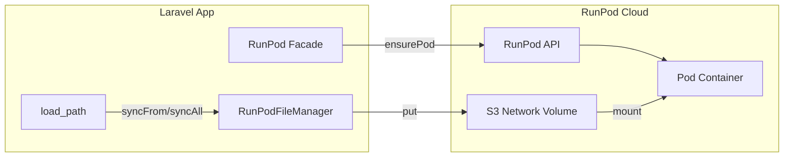
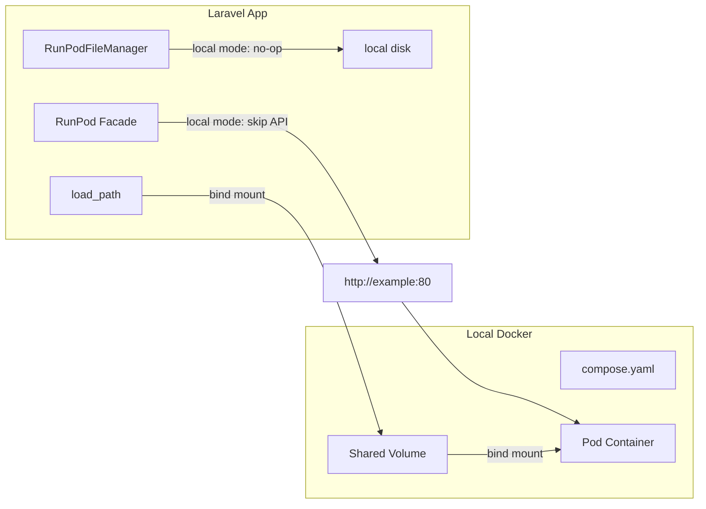

# Local Docker Mode Refactor

## Current Architecture




**Key files:**

- [config/runpod.php](config/runpod.php) - instance config under `instances`
- [src/RunPod.php](src/RunPod.php) - `disk()`, `start()`, `instance()`
- [src/RunPodFileManager.php](src/RunPodFileManager.php) - `syncFrom`, `syncAll`, `ensure`, `path()`
- [src/RunPodPodManager.php](src/RunPodPodManager.php) - `ensurePod()`, `createPod()`, state/API
- [src/LaravelRunPodServiceProvider.php](src/LaravelRunPodServiceProvider.php) - registers `runpod` S3 disk

---

## Target Architecture (Local Mode)




When `local => true`:

- No RunPod API calls (createPod, getPod, terminatePod)
- Disk uses Laravel `config/filesystems.php` disk (e.g. `local`)
- `syncFrom`, `syncAll`, `ensure` are no-ops (source = destination via bind mount)
- URL comes from config (`local_url`)

---

## 1. Config Changes

**Add to `config/runpod.php` and `docs/configuration.md`:**

Per-instance options:


| Key         | Type   | Description                                                                               |
| ----------- | ------ | ----------------------------------------------------------------------------------------- |
| `local`     | bool   | When true, use local Docker instead of RunPod cloud                                       |
| `local_url` | string | URL for the local pod (e.g. `http://example:80` or `http://localhost:8000`)             |
| `disk`      | string | Laravel disk name from `config/filesystems.php`. When local, use this instead of `runpod` |


**Example instance config:**

```php
'example' => [
    'type' => 'pod',
    'local' => env('RUNPOD_LOCAL', false),
    'local_url' => env('RUNPOD_PYMUPDF_LOCAL_URL', 'http://example:80'),
    'disk' => env('RUNPOD_PYMUPDF_DISK', 'runpod'),  // 'local' when in local mode
    'load_path' => storage_path('app/runpod'),
    'pod' => [
        'image_name' => 'ghcr.io/.../docker-example:latest',
        'volume_mount_path' => '/workspace',
        // ...
    ],
],
```

**Service provider:** When any instance is local, do not require `RUNPOD_API_KEY` at registration. Defer API key check to when a cloud operation is actually performed (or skip for local instances).

---

## 2. RunPodPodManager Changes

**File:** [src/RunPodPodManager.php](src/RunPodPodManager.php)

- Add `isLocal(): bool` - read from `$this->podConfig['local'] ?? false`
- **ensurePod()**: When local, skip lock/API; return `['url' => local_url, 'pod_id' => null]` and optionally verify URL reachable
- **getPodUrl()**: When local, return `local_url` from config
- **terminatePod()**: When local, no-op (return true) or optionally support `docker compose stop`
- **pruneIfInactive()**: When local, no-op (return false)
- **getPodDetails()**: When local, return a minimal stub `['desiredStatus' => 'RUNNING', 'url' => local_url]` for dashboard compatibility, or null
- **createPod()**: When local, never called (ensurePod short-circuits)

Pass `local` and `local_url` into pod config from instance config in `RunPod::start()`.

---

## 3. RunPod / RunPodFileManager Changes

**File:** [src/RunPod.php](src/RunPod.php)

- `disk()`: When instance is local, use `instanceConfig['disk'] ?? 'local'` instead of `config('runpod.disk')`
- Pass `isLocal` (or a `LocalMode` flag) into `RunPodFileManager` so it can no-op sync operations

**File:** [src/RunPodFileManager.php](src/RunPodFileManager.php)

- Add constructor param: `protected bool $isLocal = false`
- **syncFrom()**: When `$isLocal`, return early (no-op)
- **syncAll()**: When `$isLocal`, return early (no-op)
- **ensure()**: When `$isLocal`, return early (no-op)
- **put()**, **get()**, **exists()**: Continue to work (they operate on the disk; when disk is local, they read/write the shared path)
- **path()**: Unchanged - still returns `remotePrefix/relativePath` (e.g. `data/foo.pdf`) for pod API calls. When local, the container sees the same path via bind mount.

**Destructive operations:** The current codebase has no "move" in RunPodFileManager. The user's "move, don't copy" refers to avoiding any future or external behavior that would delete source files. In local mode, we simply skip all sync operations so no upload/copy happens - the bind mount means files are already in place.

---

## 4. Service Provider Changes

**File:** [src/LaravelRunPodServiceProvider.php](src/LaravelRunPodServiceProvider.php)

- **RunPodClient / RunPodGraphQLClient**: Only throw `RunPodApiKeyNotConfiguredException` when a cloud operation is attempted and no instance is local. Alternatively: register them as lazy - only resolve when needed, and skip registration if all instances are local (complex). Simpler: keep current behavior but have `RunPodPodManager::ensurePod` short-circuit before any client use when local. The client is still constructed; we just never call it for local instances.
- **registerRunPodDisk()**: No change - `runpod` disk still registered when S3 creds present. Local instances use a different disk from `config/filesystems.php`.

---

## 5. Command Changes


| Command            | Local mode behavior                                                             |
| ------------------ | ------------------------------------------------------------------------------- |
| `runpod:start`     | Return local URL immediately, no API call                                       |
| `runpod:sync`      | No-op when instance is local (add `--instance=` to SyncCommand for consistency) |
| `runpod:prune`     | No-op for local instances                                                       |
| `runpod:flush`     | Skip local instances (don't try to delete pods)                                 |
| `runpod:list`      | Show "local" status for local instances                                         |
| `runpod:inspect`   | Show local URL and disk, no API                                                 |
| `runpod:stats`     | For local, write minimal stats (url, status: local)                             |
| `runpod:dashboard` | Display local instances with URL, no telemetry                                  |


---

## 6. SyncCommand Instance Support

**File:** [src/Console/SyncCommand.php](src/Console/SyncCommand.php)

- Add `{--instance=}` option. When provided, call `RunPod::instance($instance)->disk()` so sync uses instance-specific disk and load_path.
- When instance is local, sync is a no-op with an informational message: "Instance X is in local mode; sync skipped (files shared via bind mount)."

---

## 7. Documentation and Compose Stub

**New doc:** `docs/local-docker.md`

- How to add the pod as a service to `compose.yaml` or `docker-compose.yaml`
- Bind mount: map `load_path` (e.g. `./storage/app/runpod`) to `volume_mount_path` (e.g. `/workspace`) in the container
- Example compose snippet:

```yaml
services:
  example:
    image: ghcr.io/christhompsontldr/nginx:alpine:latest
    ports:
      - "8000:8000"
    volumes:
      - ./storage/app/runpod:/workspace
    environment:
      PYMUPDF_DATA_DIR: /workspace
      PYMUPDF_OUTPUT_DIR: /workspace/output
```

- Config: set `local => true`, `local_url => 'http://example:80'` (or `http://localhost:8000` if accessing from host), `disk => 'local'` with a disk that uses the same path.

**config/filesystems.php (app-level):** Document that when using local mode, the app should define a disk (e.g. `runpod_local`) whose root is the same as `load_path`, so `put`/`get`/`exists` work correctly. Or use the default `local` disk if `load_path` is under `storage_path('app')`.

---

## 8. Disk Resolution for Local Mode

When `local => true` and `disk => 'local'`:

- The `local` disk in Laravel typically uses `storage_path('app')` as root.
- If `load_path` is `storage_path('app/runpod')`, then the `local` disk's path for `runpod/data/foo.pdf` would be `storage/app/runpod/data/foo.pdf`.
- `RunPodFileManager` uses `loadPath` for resolving local paths and `remotePrefix` for the "remote" key. When disk is local, the disk root might be `storage_path('app')`, so we need `remotePath` to map to `runpod/data/foo.pdf` (or similar) so that the path matches the bind mount structure.

**Simpler approach:** For local mode, the instance can define a custom disk in `config/filesystems.php` whose root is exactly `load_path`. Then:

- `remotePath('data/foo.pdf')` -> disk stores at `data/foo.pdf` relative to disk root
- Disk root = `load_path` = bind mount target
- Container sees `/workspace` = same files

So the app defines:

```php
'runpod_local' => [
    'driver' => 'local',
    'root' => storage_path('app/runpod'),
    'visibility' => 'private',
],
```

And instance config: `'disk' => 'runpod_local'` when local. The `remote_prefix` is `data`, so paths are `data/foo.pdf` - the container would need the same structure. Typically `load_path` = `storage/app/runpod` and we put files in `runpod/data/`. So the disk root could be `storage/app/runpod` and the path `data/foo.pdf` -> full path `storage/app/runpod/data/foo.pdf`. The container mounts `storage/app/runpod` at `/workspace`, so it sees `/workspace/data/foo.pdf`. The `path()` method returns `data/foo.pdf` - the pod API would receive that and the container would resolve it as `/workspace/data/foo.pdf`. Good.

---

## 9. Implementation Order

1. Config: add `local`, `local_url`, `disk` to instance schema and example
2. RunPodPodManager: add `isLocal()`, short-circuit ensurePod/getPodUrl/terminatePod/pruneIfInactive/getPodDetails
3. RunPod: pass `isLocal` and `disk` into FileManager when resolving disk
4. RunPodFileManager: add `$isLocal`, no-op syncFrom/syncAll/ensure when true
5. Commands: update Start, Sync, Prune, Flush, List, Inspect, Stats, Dashboard for local
6. Service provider: relax API key requirement when only local instances (optional; can defer)
7. SyncCommand: add `--instance=` and no-op message for local
8. Docs: `docs/local-docker.md`, update `docs/configuration.md`

---

## 10. Edge Cases

- **Mixed instances:** Some local, some cloud. API key still required for cloud. Commands iterate instances and branch on `local`.
- **Guardrails:** Skip guardrails for local instances (no API calls).
- **Stats/Dashboard:** Local instances show `status: 'local'`, `url: local_url`, no telemetry.
- **runpod:sync without instance:** Use default/first instance. If all instances are local, sync is no-op for all.

