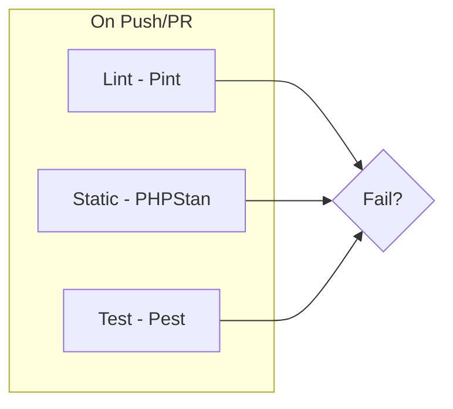

# Pest v4 Testing Stack Implementation

## Prerequisites and Constraints

**PHP version bump required**: Pest v4 requires PHP 8.3+. Your project currently requires PHP ^8.2. The plan includes bumping to `^8.3` in [composer.json](composer.json).

**Package context**: This is a Laravel package (not a full app). Testing uses `orchestra/testbench` to boot a minimal Laravel app.

---

## 1. Composer Dependencies

Update [composer.json](composer.json):

- Bump `require.php` from `^8.2` to `^8.3`
- Add `require-dev`:


| Package                                  | Purpose                                         |
| ---------------------------------------- | ----------------------------------------------- |
| `pestphp/pest` ^4.0                      | Pest v4 core                                    |
| `pestphp/pest-plugin-laravel` ^4.0       | Laravel integration (get, post, actingAs, etc.) |
| `orchestra/testbench` ^10.0              | Laravel package testing (Laravel 12)            |
| `laravel/pint` ^1.0                      | Code style fixer                                |
| `larastan/larastan` ^3.0                 | PHPStan + Laravel rules                         |
| `pestphp/pest-plugin-arch` ^4.0          | Architecture testing                            |
| `pestphp/pest-plugin-mutate` ^4.0        | Mutation testing                                |
| `pestphp/pest-plugin-stressless` ^4.0    | Stress testing                                  |
| `pestphp/pest-plugin-type-coverage` ^4.0 | Type coverage                                   |


Run: `composer update`

---

## 2. Pest Configuration (Function Mode)

Create [tests/Pest.php](tests/Pest.php):

```php
<?php

use ChrisThompsonTLDR\LaravelRunPod\Tests\TestCase;

pest()->extend(TestCase::class)->in('Feature');
```

Function mode is the default: tests use `it()` and `test()` with closures. `extend(TestCase::class)->in('Feature')` only sets the base class for Feature tests; tests remain closure-based.

---

## 3. Test Infrastructure

**Base TestCase** – [tests/TestCase.php](tests/TestCase.php):

```php
<?php

namespace ChrisThompsonTLDR\LaravelRunPod\Tests;

use ChrisThompsonTLDR\LaravelRunPod\LaravelRunPodServiceProvider;
use Orchestra\Testbench\TestCase as Orchestra;

class TestCase extends Orchestra
{
    protected function getPackageProviders($app): array
    {
        return [LaravelRunPodServiceProvider::class];
    }
}
```

**PHPUnit config** – [phpunit.xml.dist](phpunit.xml.dist):

- Source: `src/` for coverage
- Bootstrap: `vendor/autoload.php`
- Test suite: `tests/`
- XDebug/PCOV coverage config for `--coverage`

---

## 4. Pest Features Implementation

### Mutation Testing ([docs](https://pestphp.com/docs/mutation-testing))

- Add `covers()` or `mutates()` in test files to target code
- Run: `./vendor/bin/pest --mutate` (optionally `--mutate --parallel`)
- Requires XDebug 3.0+ or PCOV
- Optional: `--min=40` for minimum mutation score

### Architecture Testing ([docs](https://pestphp.com/docs/arch-testing))

Create [tests/Architecture/ArchTest.php](tests/Architecture/ArchTest.php):

```php
<?php

arch()
    ->expect('ChrisThompsonTLDR\LaravelRunPod')
    ->toUseStrictTypes()
    ->not->toUse(['die', 'dd', 'dump']);
```

Add more rules as needed (e.g. `toBeClasses()`, `toExtend()`, `toOnlyBeUsedIn()`).

### Stress Testing ([docs](https://pestphp.com/docs/stress-testing))

- Plugin: `pestphp/pest-plugin-stressless`
- Uses k6 (downloaded on first use)
- For a package without HTTP endpoints, add a placeholder test or skip. Example:

```php
<?php

use function Pest\Stressless\stress;

it('can stress test a URL', function () {
    $result = stress('https://example.com')->for(2)->seconds();
    expect($result->requests()->failed()->count())->toBe(0);
})->skip('No HTTP endpoint in package - enable when testing against app');
```

### Test Coverage ([docs](https://pestphp.com/docs/test-coverage))

- Built into Pest
- Run: `./vendor/bin/pest --coverage` (optionally `--coverage --min=80`)
- Requires XDebug 3.0+ or PCOV
- Configure `<source>` in phpunit.xml for `src/`

### Type Coverage ([docs](https://pestphp.com/docs/type-coverage))

- Run: `./vendor/bin/pest --type-coverage` (optionally `--type-coverage --min=100`)
- No tests required; analyzes type declarations

---

## 5. Laravel Pint

Create [pint.json](pint.json) or use defaults:

```json
{
    "preset": "laravel",
    "paths": ["src", "config", "tests"]
}
```

Run: `./vendor/bin/pint`

---

## 6. Larastan (PHPStan)

Create [phpstan.neon](phpstan.neon):

```neon
includes:
    - vendor/larastan/larastan/extension.neon

parameters:
    paths:
        - src/
        - config/
    level: 5
```

For packages, include `orchestra/testbench` in `require-dev` (already added). Run: `./vendor/bin/phpstan analyse`

---

## 7. GitHub Workflows

### Lint workflow – [.github/workflows/lint.yml](.github/workflows/lint.yml)

- Trigger: push, pull_request
- PHP 8.3
- Steps: checkout, setup PHP, composer install, `./vendor/bin/pint --test`

### Static analysis – [.github/workflows/static.yml](.github/workflows/static.yml)

- Trigger: push, pull_request
- PHP 8.3
- Steps: checkout, setup PHP, composer install, `./vendor/bin/phpstan analyse`

### Test workflow – [.github/workflows/tests.yml](.github/workflows/tests.yml)

- Trigger: push, pull_request
- PHP 8.3
- Steps:
  1. checkout, setup PHP (with PCOV for coverage), composer install
  2. Run `./vendor/bin/pest`
  3. Optional: `./vendor/bin/pest --coverage --min=80` (or a lower threshold initially)
  4. Optional: `./vendor/bin/pest --type-coverage --min=80`
  5. Optional: `./vendor/bin/pest --mutate --covered-only` (can be a separate job or run on schedule due to runtime)

---

## 8. Optional: Composer Scripts

Add to [composer.json](composer.json) `scripts`:

```json
"scripts": {
    "test": "pest",
    "test:coverage": "pest --coverage",
    "test:mutate": "pest --mutate",
    "test:arch": "pest tests/Architecture",
    "lint": "pint",
    "lint:fix": "pint",
    "analyse": "phpstan analyse"
}
```

---

## 9. Sample Tests

Add minimal tests so the suite runs:

- [tests/Unit/RunPodTest.php](tests/Unit/RunPodTest.php) – basic unit test
- [tests/Feature/RunPodIntegrationTest.php](tests/Feature/RunPodIntegrationTest.php) – integration test using TestCase (mocked HTTP if needed)

---

## File Summary


| Action | Path                                                               |
| ------ | ------------------------------------------------------------------ |
| Modify | [composer.json](composer.json)                                     |
| Create | [tests/Pest.php](tests/Pest.php)                                   |
| Create | [tests/TestCase.php](tests/TestCase.php)                           |
| Create | [phpunit.xml.dist](phpunit.xml.dist)                               |
| Create | [tests/Architecture/ArchTest.php](tests/Architecture/ArchTest.php) |
| Create | [pint.json](pint.json)                                             |
| Create | [phpstan.neon](phpstan.neon)                                       |
| Create | [.github/workflows/lint.yml](.github/workflows/lint.yml)           |
| Create | [.github/workflows/static.yml](.github/workflows/static.yml)       |
| Create | [.github/workflows/tests.yml](.github/workflows/tests.yml)         |
| Create | Sample unit + feature tests                                        |


---

## Diagram: CI Pipeline




