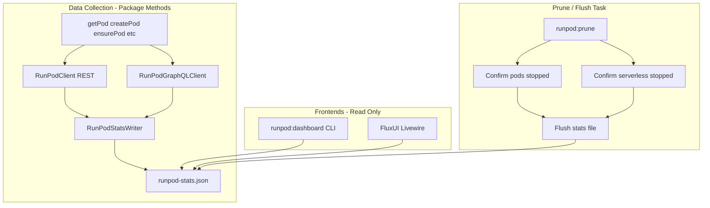

# RunPod Instance Stats Dashboard: Terminal + FluxUI Web

## Architecture Overview




**Key design:** Package methods (getPod, ensurePod, createPod, etc.) write to a stats JSON file on each RunPod API call. Terminal and FluxUI dashboards **read only** from that file. No direct API calls from frontends. The prune task confirms serverless and pods are stopped, then flushes the stats file.

---

## 1. Centralized Stats File

### 1.1 Stats file location and structure

- **Path:** `storage_path('app/runpod-stats.json')` or per-instance `runpod-stats-{instance}.json` (configurable via `config('runpod.stats_file')`)
- **Structure:**

```json
{
  "instance": "pymupdf",
  "updated_at": "2024-07-12T19:14:40.144Z",
  "pod": { /* REST getPod response with includeMachine, includeNetworkVolume */ },
  "telemetry": { /* GraphQL latestTelemetry */ },
  "time_until_kill": "01:23:45",
  "last_run_at": "2024-07-12T18:00:00.000Z",
  "inactivity_minutes": 2
}
```

- `**time_until_kill`:** Countdown as `hh:mm:ss` until prune. Formula: `last_run_at + inactivity_minutes - now`. When negative or zero, show `"00:00:00"` or `"pruning"`.

### 1.2 RunPodStatsWriter

New service [src/RunPodStatsWriter.php](src/RunPodStatsWriter.php):

- `write(string $instance, array $pod, ?array $telemetry, ?string $lastRunAt): void` – merges with existing, computes `time_until_kill`, writes JSON
- `flush(?string $instance = null): void` – clears stats file (all instances or specific instance)
- `read(?string $instance = null): ?array` – reads and returns decoded JSON

### 1.3 Hook into package methods

Invoke the stats writer **after** any RunPod API call that fetches or mutates pod state:


| Method                            | When to write             |
| --------------------------------- | ------------------------- |
| `RunPodClient::getPod`            | After successful response |
| `RunPodPodManager::ensurePod`     | After getPod or createPod |
| `RunPodPodManager::getPodDetails` | After getPod              |
| `RunPod::pod`                     | After getPodDetails       |
| `RunPod::start`                   | After ensurePod           |


Use a decorator, event, or direct call from `RunPodPodClient` / `RunPodPodManager`. Prefer a single integration point (e.g. `RunPodPodManager` or a wrapper) to avoid scattering writes.

**Scheduled refresh:** Add `runpod:stats` command (or similar) that runs on schedule (e.g. every 1–2 min), fetches pod + telemetry for each configured instance with a running pod, and writes to the stats file. This keeps the file fresh for dashboards even when no other commands run.

---

## 2. Extend RunPod Client (Package)

### 2.1 REST: Add query params to `getPod`

Extend [src/RunPodClient.php](src/RunPodClient.php) to accept optional `$params` (e.g. `includeMachine`, `includeNetworkVolume`).

### 2.2 GraphQL client for telemetry

Create `RunPodGraphQLClient` that POSTs to `https://api.runpod.io/graphql` and fetches `pod.latestTelemetry`. Used by the stats writer when collecting data.

---

## 3. Terminal Dashboard (Package)

### 3.1 Artisan command: `runpod:dashboard`

- **Signature:** `runpod:dashboard {instance?} {--refresh=5}`
- **Behavior:** Reads from the stats JSON file (no API calls). Uses `termwind-plugin-live` `live()` with `refreshEvery(seconds: $refresh)`.
- **Layout:** Header (pod name, status, cost), specs table, telemetry section, **time-until-kill countdown** (hh:mm:ss).

**Layout sketch:**

```
┌─ RunPod Dashboard: pymupdf ─────────────────────────────────┐
│ Pod: eyejay-pymupdf  │  Status: RUNNING  │  $0.74/hr       │
│ Time until prune: 01:23:45                                  │
├────────────────────────────────────────────────────────────┤
│ Specs                                                      │
│   vCPUs: 24    Memory: 62 GB    GPU: 1x NVIDIA RTX 4090   │
├────────────────────────────────────────────────────────────┤
│ Telemetry                                                  │
│   CPU: 12%    Memory: 34%    GPU: 8%    Temp: 42°C         │
└────────────────────────────────────────────────────────────┘
```

---

## 4. FluxUI Web Dashboard (Publishable)

### 4.1 Components

- `**RunPodDashboard**` Livewire component reads from the stats file on `mount()` and `refresh()`.
- Uses `wire:poll.15s="refresh"` – each poll reads the file (no API calls).
- Renders Flux cards and Flux Pro charts from `telemetry` history (if we append samples to the stats file over time) or current snapshot.

### 4.2 Time-until-kill in UI

Display the countdown prominently (e.g. Flux stat card or badge). Format: `hh:mm:ss`.

---

## 5. Prune and Flush Task

### 5.1 Extend `runpod:prune`

**Flow:**

1. **Prune pods** – For each instance (or specified instance), run existing `pruneIfInactive()` logic. Terminate inactive pods.
2. **Confirm serverless stopped** – For instances with `type: serverless`, verify no running workers (e.g. via `listEndpoints` and endpoint worker count). If any serverless workers are running, skip flush for that instance (or log and continue).
3. **Confirm pods stopped** – After prune, state should reflect no pod (or terminated). Verify state is clear.
4. **Flush stats** – Call `RunPodStatsWriter::flush($instance)` to clear the stats file. Frontends will then show "no data" or "all stopped".

### 5.2 Schedule

The existing `runpod:prune` schedule continues to run. Prune command is extended to perform the flush step after confirming serverless and pods are stopped.

---

## 6. File Changes Summary


| File                               | Action                                                |
| ---------------------------------- | ----------------------------------------------------- |
| `src/RunPodStatsWriter.php`        | **New** – write/read/flush stats JSON                 |
| `src/RunPodClient.php`             | Add optional `$params` to `getPod()`                  |
| `src/RunPodGraphQLClient.php`      | **New** – GraphQL client for telemetry                |
| `src/RunPodPodManager.php`         | After getPod/createPod/ensurePod, call stats writer   |
| `src/Console/PruneCommand.php`     | Add confirm serverless + pods stopped, then flush     |
| `src/Console/StatsCommand.php`     | **New** – `runpod:stats` scheduled refresh (optional) |
| `src/Console/DashboardCommand.php` | **New** – `runpod:dashboard` reads from stats file    |
| `config/runpod.php`                | Add `stats_file` config                               |
| Livewire/Flux components           | Read from stats file; display time-until-kill         |
| `composer.json`                    | Add termwind, termwind-plugin-live as suggest         |


---

## 7. Implementation Order

1. **RunPodStatsWriter** – Core service for write/read/flush
2. **GraphQL client** – For telemetry in stats
3. **Hook stats writer** – Into getPod, ensurePod, getPodDetails
4. **Time-until-kill** – Compute in writer, include in JSON
5. **runpod:stats** – Scheduled command to refresh stats file
6. **Extend prune** – Confirm serverless + pods, then flush
7. **Terminal dashboard** – Read from file, display countdown
8. **FluxUI dashboard** – Read from file, wire:poll, display countdown

---

## 8. Notes

- **Stale stats:** If no commands run, stats file can be stale. `runpod:stats` on a short schedule (1–2 min) keeps it fresh.
- **Serverless:** Package has serverless support; prune/flush should handle both pod and serverless instance types.
- **Flux Pro:** Chart component requires `php artisan flux:activate` in the consuming app.

